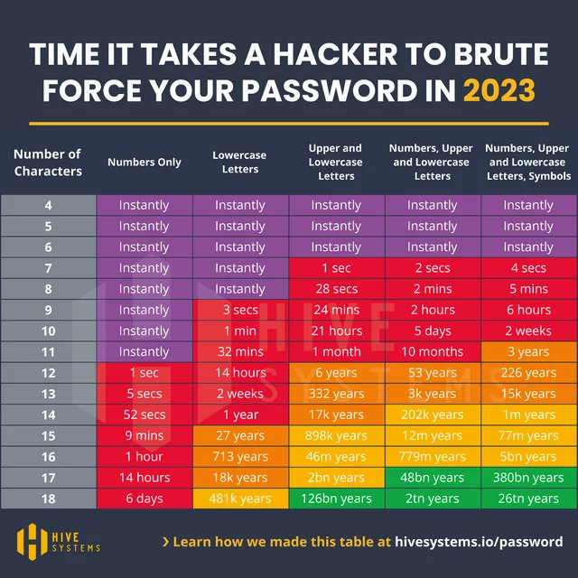

Personal Cybersecurity 101 

FileVault 

Mot de passe utilisateur 

Sur la sécurité des mots-de passe:

Utilisation de Keychain, generateur et gestionneur des mot de passe MacOS 

Securisation iCloud, gMail etc. 2FA 

dernier recours, comment ne pas faire crypto-autogoal… 

## Ressources

Voir aussi (pour les Gestionnaires de mots de passe):

[Outils > Sécurité](https://cours-web.ch/outils/securite.html)