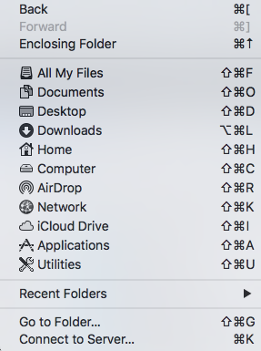

Utiliser le clavier. Raccourcis clavier. Trouver les combinaisons de touche pour des raccourcis, ou des caractères spéciaux, p.ex: des charactères comme: œ, °, É, æ, –, —, ...  

## Raccourcis classiques ⌘-Z, ⌘-X, ⌘-C, ⌘-V

Selon Wikipédia:

> Larry Tesler created the concept of **cut**, **copy**, **paste**, and **undo** for human-computer interaction while working at Xerox PARC to control text editing. During the development of the Macintosh it was decided that the cut, paste, copy and undo would be used frequently and assigned them to the ⌘-Z (Undo), ⌘-X (Cut), ⌘-C (Copy), and ⌘-V (Paste).

Autres usages classiques, partagés par de nombreux logiciels :

Effectuer une recherche : Cmd-F

Insérer un hyperlien : Cmd-K

Copier l'URL de la page actuelle dans un navigateur:

Cmd-L (sélectionner le champ), Cmd-C (copier l'URL)

## Liste des raccourcis MacOS:

[https://support.apple.com/fr-ch/HT201236](https://support.apple.com/fr-ch/HT201236)

Connaître les raccourcis du Finder pour naviguer dans l'arborescence des dossiers.

- Commande + Barre d’espace : afficher ou masquer le champ de recherche Spotlight.

## Raccourcis Apple et claviers PC

Comment faire fonctionner certains raccourcis d'application si on a un clavier non-Apple ?

Customiser des raccourcis clavier MacOS avec [Karabiner-Elements](https://karabiner-elements.pqrs.org/), une application gratuite.
